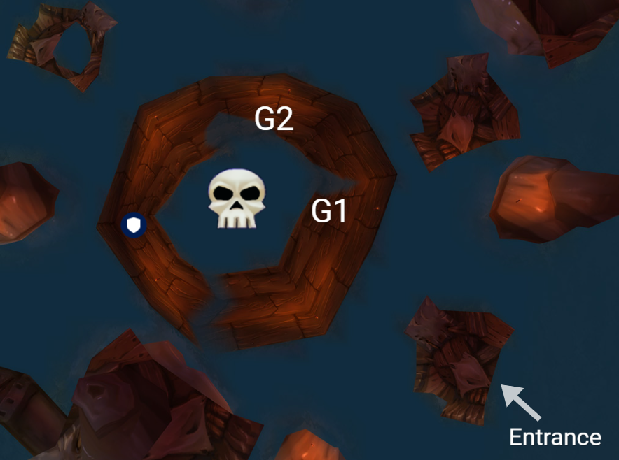
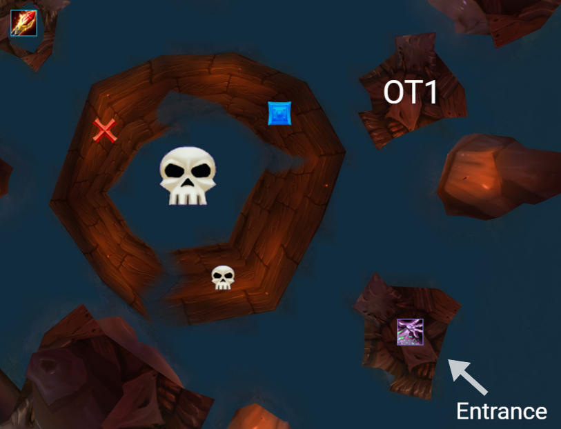
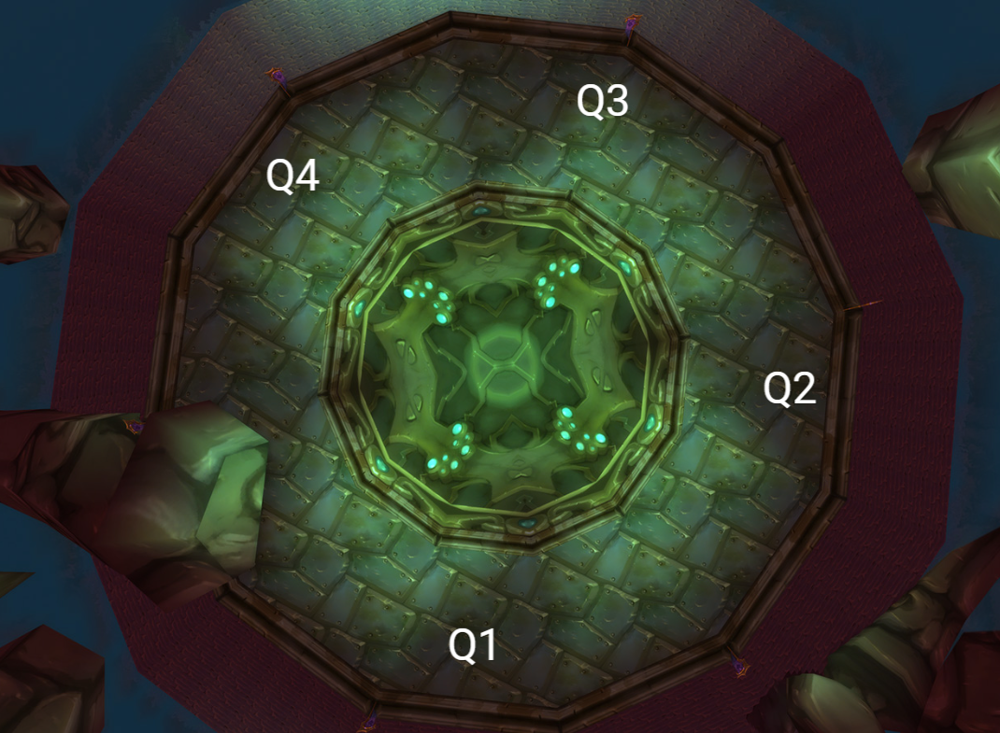

# Serpentshrine Cavern

## Pre Hydross Trash
### Coilfang & Bats Pack
Marker | Mob | Tank | Misdirect | Notes
-------|-----|------|-----------|------
 | Serpentshrine Sporebat | Mahaka | Holo/Buddy| Charges furthest enemy
 | Serpentshrine Sporebat | Mahaka | N/A | Charges furthest enemy
 | Coilfang Beast-Tamer | Mahaka  | N/A | Cleaves
 | Coilfang Hate Screamer | Tankadin | Vili/Naz | AoE Silence
 | Coilfang Hate Screamer | Tankadin | N/A | AoE Silence
* All players, pets, and totems need to be stacked
* %OT2% sits out to soak charge

### Underbog Colossus
* Ranged play from **max range** to avoid quake (30yds)
    * Heals should only be on the tank/melee
* Cleanse Rampant Infection (disease)
* Always hug left, target of Acid Geyser move right
* Tranquilizing Shot Frenzy
* On death one of the following will occur:
    * Nothing
    * Toxic Pool - Move out, AoE is larger then visual
    * Two Colossus Lurkers - Threat drop, tauntable
    * Lots of small adds - AoE
    * Blue Mushrooms - Regenerates mana/health

## Hydross (~2m 15s)
* Use pathing mobs to proc chickens
    * Person using chicken must have taken damage from the mob
    * **No DPS** until the call to drop combat is made
* Frost Resistance Totem in Mahaka group in P1
* Nature Resistance Totem in Tankadin group in P2
* MD Mahaka on pull
### Bloodlusts
\# of shamans | Groups | Timings
-------------|--------|---------
4 | G1, G2, G3 & G2 | On pull & 1m 30s in
5 | G1, G2, G3 & G2, G3 | On pull & 1m 30s in
6 | G1, G2, G3, G4 & G2, G3 | On pull & 1m 30s in

* Melee stack in designated area
* Ranged groups loosely spread in designated area
* Threat drop on transition **Stop DPS**
* Banish adds
    *  - KILL
    *  - Irsic
    *  - Dwwee
    *  - Aithus

## Post Hydross Trash
### Lurker Platforms (6 platforms ~10m)
Marker | Mob | Tank | Misdirect | Notes
-------|-----|------|-----------|------
 | Vashj'ir Honor Guard | Mahaka | Holo/Buddy | AoE fear & knock back
 | Coilfang Shatterer | Tankadin | N/A | Armor Sunder, spell reflectable
 | Coilfang Shatterer | Tankadin | Vili/Naz | Armor Sunder, spell reflectable
 | Coilfang Priestess | Tankadin | N/A | Heal, interruptable
 | Coilfang Priestess | Mahaka | N/A | Heal, interruptable
* Melee Cleave off Skull
* Tremor fear
* Interrupt Priestess heals

## The Lurker Below (<4m)
### Boss Phase (>1m 30s)

* G1 and G2 melee spread in designated areas
    * Jump into Whirl to avoid knock back out of range
* Raid spread to avoid Geyser
* Spout avoidable by being in the water
    * Don't jump, causes additional water damage ticks

### Add Phase (until all adds are dead or 60s)

Marker | Mob | Tank | Misdirect | Notes
-------|-----|------|-----------|------
 | Coilfang Guardian | Tankadin | Holo | Stun/Disarmable
 | Coilfang Guardian | Tankadin | Vili | Stun/Disarmable
 | Coilfang Guardian | Mahaka | Buddy | Taunted by Tankadin
* Mages Polymorph Coilfang Ambushers on mage platform
* Locks Fear Coilfang Ambushers on lock platform
* AoE Coilfang Guardian and Coilfang Ambusher on Tankadin
* Kill lock platform
* Kill mage platform

### Bloodlusts
\# of shamans | Groups | Timings
-------------|--------|---------
4 | G1, G2, G3 & G2 | On pull & after 1st add phase
5 | G1, G2, G3 & G2, G3 | On pull & after 1st add phase
6 | G1, G2, G3, G4 & G2, G3 | On Pull & after 1st add phase

## Post Lurker Trash
* Serpentguard pack
* Underbog Colossus
* Serpentguard pack
* Fathom-Witch Pack
* Greyheart Mini Pack
* Greyheart Pack + Lurker x3
* Greyheart Pack

### Serpentguard Pack
Marker | Mob | Tank | Misdirect | Notes
-------|-----|------|-----------|------
 | Greyheart Tidecaller | Mahaka | Holo/Buddy | Summons water elemental totems
 | Coilfang Serpentguard | Tankadin | N/A | Cleaves, spell reflect
 | Coilfang Serpentguard | Tankadin | Vili/Naz | Cleaves, spell reflect
 | Greyheart Skulker | Mahaka | N/A | Kicks nearby casts
 | Greyheart Nether-Mage | Sealbooper | N/A | Polymorph
 | Greyheart Nether-Mage | Zanttymage | N/A | Polymorph
* Melee focus Water Elemental Totems first
* Watch poison cleanse while Greyheart Tidecaller is up

### Underbog Colossus
* Ranged play from **max range** to avoid quake (30yds)
    * Heals should only be on the tank/melee
* Cleanse Rampant Infection (disease)
* Always hug left, target of Acid Geyser move right
* Tranquilizing Shot Frenzy
* On death one of the following will occur:
    * Nothing
    * Toxic Pool - Move out, AoE is larger then visual
    * Two Colossus Lurkers - Threat drop, tauntable
    * Lots of small adds - AoE
    * Blue Mushrooms - Regenerates mana/health

### Fathom-Witch Pack
Marker | Mob | Tank | Misdirect | Notes
-------|-----|------|-----------|------
 | Coilfang Fathom-Witch | Mahaka | Holo/Buddy | AoE knock back, watch edges
 | Coilfang Fathom-Witch | Mahaka | N/A | AoE knock back, watch edges
 | Coilfang Serpentguard | Tankadin | Vili/Naz | Cleaves, spell reflect
 | Coilfang Serpentguard | Tankadin | N/A | Cleaves, spell reflect
* Grounding Totem for all groups while Coilfang Fathom-Witch is alive

### Greyheart Pack
Marker | Mob | Tank | Misdirect | Notes
-------|-----|------|-----------|------
 | Greyheart Tidecaller | Mahaka | N/A | Summons water elemental totems
 | Greyheart Tidecaller | Tankadin | N/A | Summons water elemental totems
 | Greyheart Nether-Mage | Sealbooper | N/A | Polymorph
* Melee focus Water Elemental Totems first

### Greyheart Pack (5 random mobs, mini has 3)
Kill Order | Mob | Notes
-----------|-----|------
1 | Greyheart Tidecaller | Summons water elemental totems
2 | Greyheart Shield-Bearer | Stack to avoid charge
3 | Serpentshrine Lurker | Spawns mushrooms that explode
4 | Greyheart Skulker | Kicks nearby casts
5 | Greyheart Nether-Mage | Can be polymorphed, big AoE damage
* Melee focus Water Elemental Totems
* Stack if pack includes Greyheart Shield-Bearer

### Leo Packs
Marker | Mob | Tank | Misdirect | Notes
-------|-----|------|-----------|------
 | Greyheart Tidecaller | Mahaka | N/A | Summons water elemental totems
 | Greyheart Tidecaller | Tankadin | Vili/Naz | Summons water elemental totems
 | Serpentshrine Lurker | Tankadin | N/A | Spawns mushrooms that explode
 | Greyheart Shield-Bearer | Mahaka | Holo/Buddy | Stack to avoid charge
 | Greyheart Nether-Mage | Sealbooper | N/A | Polymorph
* Melee focus Water Elemental Totems first

## Leotheras The Blind (4m)
### Add Phase (~40s)
Marker | Mob | Tank | Misdirect | Notes
-------|-----|------|-----------|------
 | Greyheart Spellbinder | Mahaka | Holo/Buddy | N/A
 | Greyheart Spellbinder | Tankadin | Vili/Naz | N/A
 | Serpentshrine Spellbinder | Naz | N/A | N/A
* Pre PWS all melee
* Melee Nightmare Seed on pull
* Melee spread around on pull

### Human Phase (1m)
* Ranged spread out to avoid whirlwind
* **STOP DPS** at transition

### Demon Phase (1m)
* Tanked by Irsic wearing fire resist gear
* **STOP DPS** at transition

### Dual Phase (Happens at 15%)
* Attackable if transitions while in Demon form
* DPS Focus Human
* Demon tanked by Irsic wearing fire resist gear

### Bloodlusts
\# of shamans | Groups | Timings
-------------|--------|---------
3 | G1, G2, G3 | On Pull
4 | G1, G2, G3 & G2 | On pull & 3m in
5 | G1, G2, G3 & G2, G3 | On pull & 3m in
6 | G1, G2, G3, G4 & G2, G3 | On Pull & 3m in

## Post Leo Trash
* Greyheart Pack x2
* Greyheart Mini Pack
* Underbog Colossus x5

### Greyheart Pack (5 random mobs, mini has 3)
Kill Order | Mob | Notes
-----------|-----|------
1 | Greyheart Tidecaller | Summons water elemental totems
2 | Greyheart Shield-Bearer | Stack to avoid charge
4 | Greyheart Skulker | Kicks nearby casts
5 | Greyheart Nether-Mage | Can be polymorphed, big AoE damage
* Melee focus Water Elemental Totems
* Stack if pack includes Greyheart Shield-Bearer

### Underbog Colossus
* Ranged play from **max range** to avoid quake (30yds)
    * Heals should only be on the tank/melee
* Cleanse Rampant Infection (disease)
* Always hug left, target of Acid Geyser move right
* Tranquilizing Shot Frenzy
* On death one of the following will occur:
    * Nothing
    * Toxic Pool - Move out, AoE is larger then visual
    * Two Colossus Lurkers - Threat drop, tauntable
    * Lots of small adds - AoE
    * Blue Mushrooms - Regenerates mana/health

## Fathom-Lord Karathress (2m 45s)
Marker | Mob | Tank | Misdirect | Notes
-------|-----|------|-----------|------
 | Fathom-Guard Tidalvess | Tankadin | Holo/Buddy | Windfury, big burst potential
 | Fathom-Guard Sharkkis | Tankadin | Vili/Naz | Summons adds
 | Fathom-Guard-Caribdis | Saders | Naz | Interupt Heals
 | Fathom-Lord Karathress | Mahaka | N/A | Move out if approaching 80%
* Kill order: Spitfire Totem, Sporebats, Lurker, Tidalvess, Sharkkis, Caribdis, Karathress
* Avoid Tornados
* Bring Caribdis out from corner when Sharkkis dies

### Bloodlusts
\# of shamans | Groups | Timings
-------------|--------|---------
3 | G1, G2, G3 | On Pull
4 | G1, G2, G3 & G2 | On pull & 2m in
5 | G1, G2, G3 & G2, G3 | On pull & 2m in
6 | G1, G2, G3, G4 & G2, G3 | On Pull & 2m in

## Post Fathom-Lord Trash
* Shatterer Pack
* Tidewalker Pack x4

### Shatterer Pack
Marker | Mob | Tank | Misdirect | Notes
-------|-----|------|-----------|------
 | Coilfang Fathom-Witch | Mahaka | Holo/Buddy | AoE knock back
 | Coilfang Fathom-Witch | Mahaka | N/A | AoE knock back
 | Coilfang Serpentguard | Tankadin | N/A  | Cleaves, spell reflect
 | Coilfang Shatterer | Tankadin | Vili/Naz | Shatter Armor
 | Coilfang Shatterer | Tankadin | N/A | Shatter Armor
* Grounding Totem for all groups while Coilfang Fathom-Witch is alive

### Tidewalker Pack (5-6 random mobs)
Kill Order | Mob | Notes
-----------|-----|------
1 | Tidewalker Depth-Seer| Uninterruptible tranquility
2 | Tidewalker Harpooner | Net primary target then drop aggro, tauntable
2 | Tidewalker Hydromancer | Frost nova, stunnable, silencable
2 | Tidewalker Shaman | Immune to CC, interruptible
3 | Tidewalker Warrior | Cleaves, Enrage, Threat Drop
* Freedom on Tanks
* Tranquilizing Shot Tidewalker Warriors Frenzy

## Morogrim Tidewalker (3m 30s)
* **STOP HEALS**, except on MT, on add spawn
* AoE adds once Tankadin has threat
* Avoid water bubbles after 25%

### Bloodlusts
\# of shamans | Groups | Timings
-------------|--------|---------
3 | G1, G2, G3 | On Pull
4 | G1, G2, G3 & G2 | On pull & 3m in
5 | G1, G2, G3 & G2, G3 | On pull & 3m in
6 | G1, G2, G3, G4 & G2, G3 | On Pull & 3m in

## Post Morogrim Trash
* Fathom-Witch Pack

### Fathom-Witch Pack
Marker | Mob | Tank | Misdirect | Notes
-------|-----|------|-----------|------
 | Coilfang Fathom-Witch | Mahaka | Holo/Buddy | AoE knock back, watch edges
 | Coilfang Fathom-Witch | Mahaka | N/A | AoE knock back, watch edges
 | Coilfang Serpentguard | Tankadin | Vili/Naz | Cleaves, spell reflect
 | Coilfang Serpentguard | Tankadin | N/A | Cleaves, spell reflect
* Grounding Totem for all groups while Coilfang Fathom-Witch is alive

## Lady Vashj (8m+)

* Burn all Lay on Hands prior to fight

### Phase One (75% ~1m 10s)
* Grounding Totem in Mahaka Group
* Static Charge target needs to move out

### Phase Two (4 Cores 5m)
#### Elementals
Quadrant | DPS | Healer
---------|-----|--------
1 | Vili | Firebad
2 | Buddy | ZTK
3 | Holo | Ieyla
4 | Naz | Creole
* DPS focus on killing all elementals in their quadrant and looting the tainted core
* Healer keeps DPS alive and acts as first pass to top of stairs
* Healer passes to Elice/Tik

#### Coilfang Striders
* Tanked by Egv at max range to avoid fear
* Ranged and melee with ogre suits DPS
* Look for misdirects to Mahaka
* Stunnable

#### Coilfang Elite
* Tanked by either Tankadin or Mahaka
* Non ogre suit melee
* All DPS when no Strider alive

### Phase Three (2m)
* Clean up adds
* Drop thornlings, land mines, excess totems on the edges
* Grounding Totem in Mahaka Group
* Static Charge target needs to move out
* Tankadin and %OT2% taunt Mind Controlled players out of center

### Bloodlusts
\# of shamans | Groups | Timings
-------------|--------|---------
3 | G1, G2, G3 | After add clean up P3
4 | G1, G2, G3 & G2 | After add clean up & combo Strider/Elite spawn
5 | G1, G2, G3 & G2, G3 | After add clean up & combo Strider/Elite spawn
6 | G1, G2, G3, G4 & G2, G3 | After add clean up & combo Strider/Elite spawn
